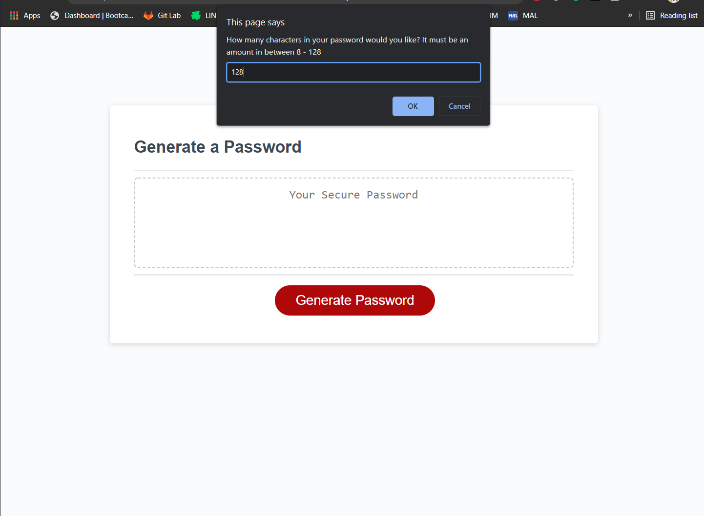
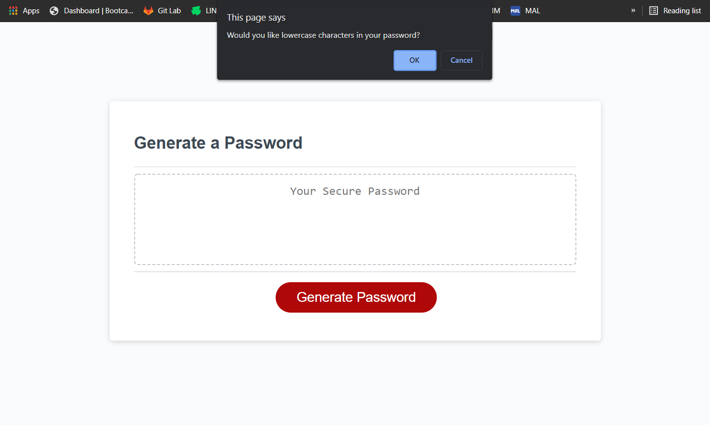
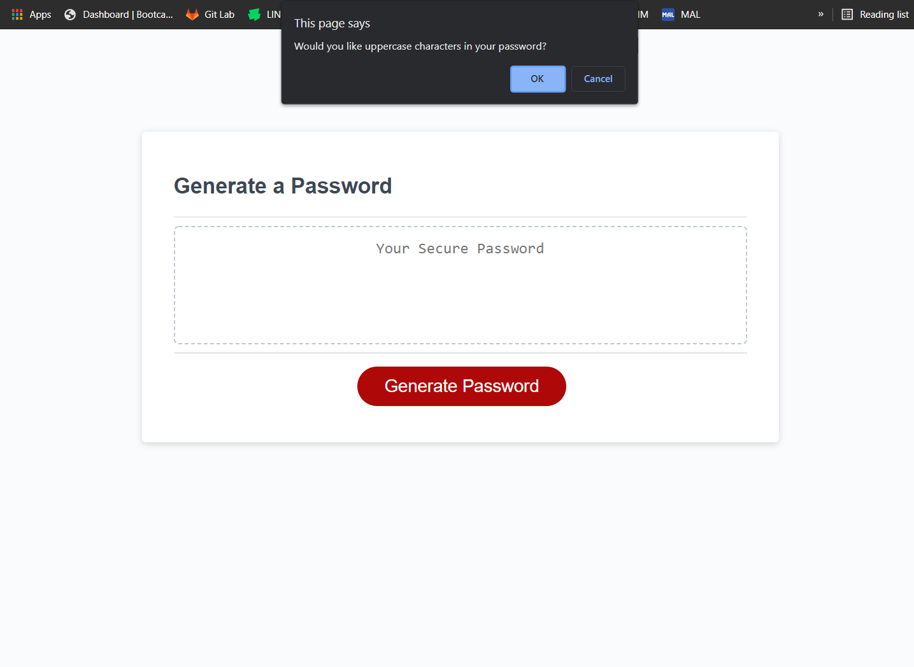
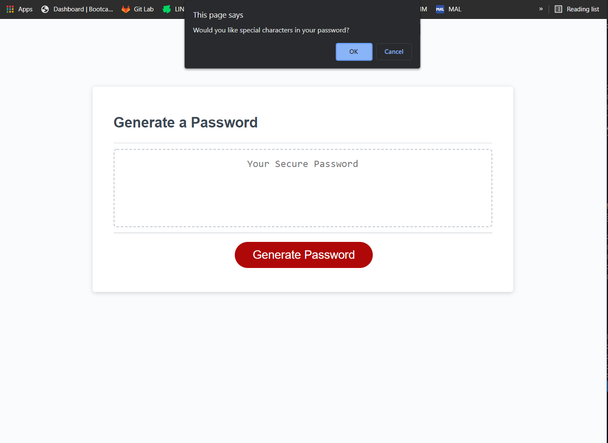
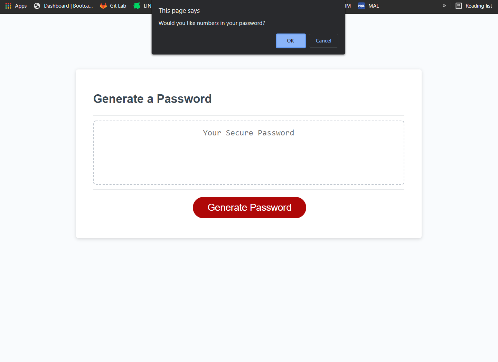
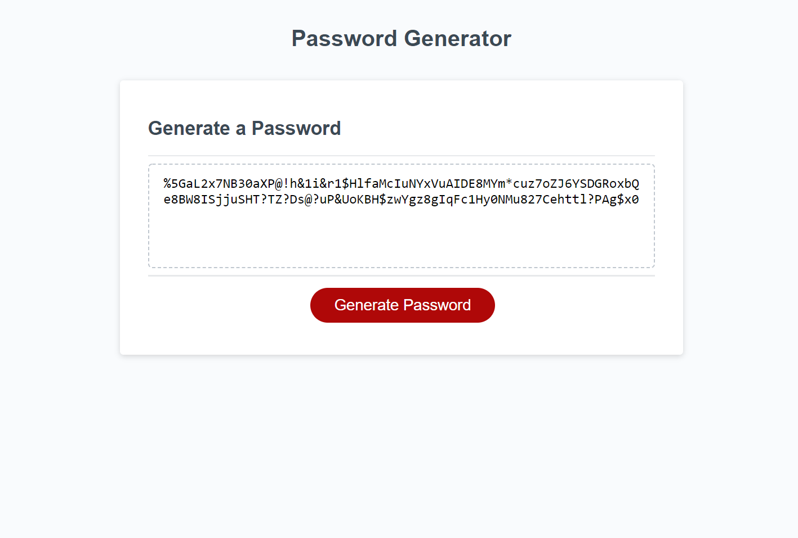

# Password-Generator

## Description

 I was tasked with making a password generator that asks the user the length of the password they wish to have and the types of characters they would like to have like uppercase letters, lowercase letters, numbers, and special characters. The website is also supposed to check if the user has less than 8 characters, more than 128 characters, and/or chose to not have any types of characters and stop the user to correct the issue so that they can stay within the parameters. 

## Installation

* If you wish to install this for future development you can follow these steps
    1. Fork the repository from Github (The link to the github is: 
        https://github.com/EvoL1e/Password-Generator)
    2. Clone the repository by going to the green code button
    3. Open up GitBash (Windows) or Terminal (MacOs) and write down git clone (SSH key link from the green code button)
    4. Once cloned go to wherever you your cloned files set up to go to
    5. Open the file with your IDE of choice and start coding or right click the index.html file and and look at the website locally on your machine.

## Usage

If you would like to use the password generator you can go to the link below and get your own randomized password. When you click the generate button it will ask how long you'd like your password and what type of characters within the password you would like before it generates it and prints it to the box.
  https://evol1e.github.io/Password-Generator/

* Images of the functionality of the webpage

## Credits

Credits go to our instructor, Farish Kashefinejad, who did a structured review of the homework and gave us more code to work off of and me, Abraam Ibrahim, for finishing the code that was handed in the homework itself and by the instructor in his structured review.

## Licencees 
Permission is hereby granted, free of charge, to any person obtaining a copy of this software and associated documentation files (the "Software"), to deal in the Software without restriction, including without limitation the rights to use, copy, modify, merge, publish, distribute, sublicense, and/or sell copies of the Software, and to permit persons to whom the Software is furnished to do so, subject to the following conditions:

The above copyright notice and this permission notice shall be included in all copies or substantial portions of the Software.

THE SOFTWARE IS PROVIDED "AS IS", WITHOUT WARRANTY OF ANY KIND, EXPRESS OR IMPLIED, INCLUDING BUT NOT LIMITED TO THE WARRANTIES OF MERCHANTABILITY, FITNESS FOR A PARTICULAR PURPOSE AND NONINFRINGEMENT. IN NO EVENT SHALL THE AUTHORS OR COPYRIGHT HOLDERS BE LIABLE FOR ANY CLAIM, DAMAGES OR OTHER LIABILITY, WHETHER IN AN ACTION OF CONTRACT, TORT OR OTHERWISE, ARISING FROM, OUT OF OR IN CONNECTION WITH THE SOFTWARE OR THE USE OR OTHER DEALINGS IN THE SOFTWARE.